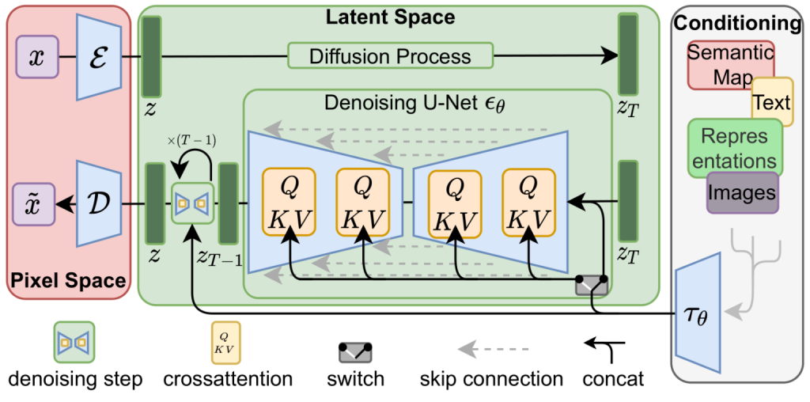
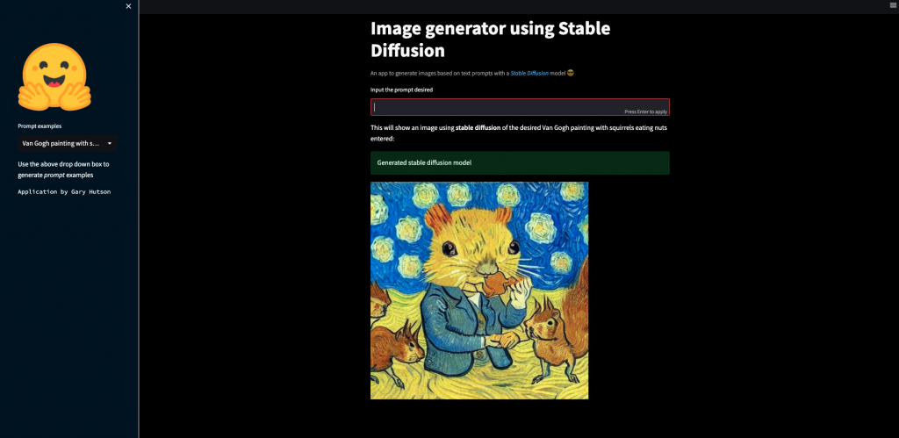

# Stable Diffusion Streamlit app

This application was inspired by the Stable Diffusion model which is a combination of a UNET (denoising function), Variational Autoencoder, CLIP text-to-image mapping and a gaussian noise function. The full flow is captured hereunder: 



I will take you through how to fine tune one of these models in a later tutorial. 

1. To run the app you will need to create a virtual environment of your choosing, be that pyenv, anaconda, virtualenv and then use the requirements.txt file with: 

```
pip install -r requirements.txt
```
2. This will install the relevant setup files to enable you to reproduce the application with the right packages. Please note you will need to use a computer with a **gpu** present, otherwise the script will throw a MemoryError.
3. To run the streamlit application use:

```
cd streamlit_app
python streamlit_app.py
```
4. This will run the application and when successful say to run this application use:

```
streamlit run [user folder]/streamlit_app.py
```
5. The application will run and then you will be given a URL to run the application in your browser. Paste the URL into the browser and away you go. 

The below image is an example of an image generated by the application:


